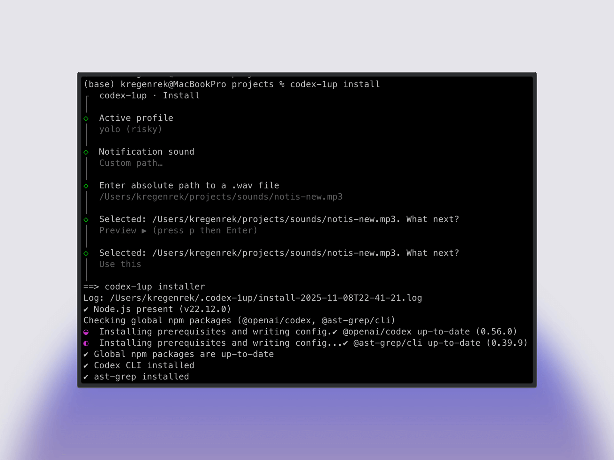

# Codex CLI 1UP


**Codex 1UP** equips your Codex CLI coding agent with powerful tools.

- ✅ Installs/updates **Codex CLI** (`@openai/codex`)
- ✅ Adds fast shell power tools: `rg`, `fd`, `fzf`, `jq`, `yq`, `ast-grep`, `bat`, `git`, `git-delta`, `gh`
- ✅ **AGENTS.md** template with tool selection guide
- ✅ Unified **Codex config** with multiple profiles: `balanced` / `safe` / `yolo`
- ✅ 🔊 **Notification sounds** with customizable audio alerts for Codex events
- ✅ Built‑in `codex-1up update`, `tools`, and `skills` commands for ongoing maintenance



## Quick start

```bash
# Quick install (no global install needed)
npx -y codex-1up install
```

```bash
# Or install globally (recommended for repeated use)
npm install -g codex-1up
codex-1up install
```

```bash
# Or install via Homebrew (macOS/Linux)
brew install regenrek/tap/codex-1up
codex-1up install
```

### After installing

- Open a new terminal session (or source your shell rc)
- Run `codex` to sign in and start using the agent! 🎉

> **⚠️ Security Warning:** `codex-1up` helps you set up Codex CLI, but **use caution with the `yolo` profile**. The `yolo` profile grants full system access and can modify any file on your computer. If you're unsure what you're doing, use the default `balanced` profile or the standard Codex install. Always review changes before approving them.

### What gets installed

| Component                 | Why it matters                                                                          |
| ------------------------- | --------------------------------------------------------------------------------------- |
| **@openai/codex**         | The coding agent that can read, edit, and run your project locally.                     |
| **ast-grep**              | Syntax‑aware search/replace for safe, large‑scale refactors in TS/TSX.                  |
| **fd**                    | Fast file finder (gitignore‑aware).                                                     |
| **ripgrep (rg)**          | Fast text search across code.                                                           |
| **fzf**                   | Fuzzy‑finder to select among many matches.                                              |
| **jq** / **yq**           | Reliable JSON/YAML processing on the command line.                                      |
| **bat**                   | Better `cat` with syntax highlighting.                                                 |
| **git**                   | Version control CLI (required for many workflows).                                     |
| **git-delta**             | Better `git diff` output formatting.                                                   |
| **gh**                    | GitHub CLI for repo and PR workflows.                                                  |
| **\~/.codex/config.toml** | Single template with multiple profiles. Active profile is chosen during install (default: `balanced`). See [Codex config reference](https://github.com/openai/codex/blob/main/docs/config.md). |
| **AGENTS.md**             | Minimal per‑repo rubric; installer can also create global `~/.codex/AGENTS.md`.         |
| **\~/.codex/skills**      | Optional bundled Agent Skills (portable folders with `SKILL.md` + scripts/references). |
| **\~/.codex/notify.sh**   | Notification hook script with customizable sounds for Codex events (default: `noti_1.wav`). |


### Profiles

| Profile | Model | Sandbox | Description |
| --- | --- | --- | --- |
| balanced (default) | gpt-5.2-codex | workspace-write | Approvals on-request; web search on. Standard for everyday use. |
| safe | gpt-5.2-codex | read-only | Approvals on-failure; web search off. Maximum security for critical repos. |
| yolo | gpt-5.2-codex | danger-full-access | Never ask for approvals; high reasoning; optimized for long autonomous sessions. ⚠️ **Warning:** Grants full system access. |

Switch profiles anytime: `codex --profile <name>` for a session, or `codex-1up config set-profile <name>` to persist.

## Global guidance with AGENTS.md (optional)

You can keep a global guidance file at `~/.codex/AGENTS.md` that Codex will use across projects. During install, you'll be prompted to create this; if you skip, you can create it later:

```bash
# Create the directory if needed and write the template there
mkdir -p ~/.codex
codex-1up agents --path ~/.codex
# This writes ~/.codex/AGENTS.md
```

See memory behavior with AGENTS.md in the official docs: [Memory with AGENTS.md](https://github.com/openai/codex/blob/main/docs/getting-started.md#memory-with-agentsmd).

## Bundled Agent Skills (optional)

codex-1up can install bundled skills into `~/.codex/skills`. During install you can choose **None**, pick specific skills, or install all. Skills are portable folders containing `SKILL.md` plus optional scripts and references.

## CLI commands

```bash
# Primary install flow (interactive wizard by default)
codex-1up install

# Self-update codex-1up
codex-1up update

# Tool management
codex-1up tools list
codex-1up tools install rg,fd
codex-1up tools install all
codex-1up tools doctor

# Bundled skills
codex-1up skills list
codex-1up skills install debug-lldb
codex-1up skills install all
codex-1up skills refresh

# Configuration helpers
codex-1up config profiles
codex-1up config set-profile balanced
```

## Doctor & Uninstall

```bash
./bin/codex-1up doctor
./bin/codex-1up uninstall
```

> **Note:** This project is **idempotent**—running it again will skip what's already installed. It won't remove packages on uninstall; it cleans up files under ~/.codex (backups are retained).

## Supported platforms

- macOS (Intel/Apple Silicon) via **Homebrew**
- Linux via **apt**, **dnf**, **pacman**, or **zypper**
  - **Note:** Linux package managers require `sudo` access (or running as root) to install tools. If `sudo` is not available or fails, the installer will skip tool installations gracefully with a warning message.
- Windows users: use **WSL** (Ubuntu) and run the Linux path

### Common flags

- `--shell auto|zsh|bash|fish` : shell to configure aliases for
- `--vscode EXT_ID`        : install a VS Code extension (e.g. `openai.codex`)
- `--agents-md [PATH]`     : write a starter `AGENTS.md` to PATH (default: `$PWD/AGENTS.md`)
- `--no-vscode`            : skip VS Code extension checks
- `--install-node nvm|brew|skip` : how to install Node.js if missing (default: `skip`)
- `--codex-cli yes|no`     : install/upgrade Codex CLI (default: `yes` on macOS/Linux)
- `--tools all|skip|<comma-separated>` : install/update tools: rg, fd, fzf, jq, yq, ast-grep, bat, git, git-delta, gh (default: `all` on macOS/Linux)
- `--profile balanced|safe|yolo|skip` : profile to write (default: `balanced`)
- `--profile-mode add|overwrite` : profile merge strategy (default: `add`)
- `--skills all|skip|<comma-separated>` : install bundled skills into `~/.codex/skills` (default: `skip`)

### Advanced / CI flags

- `--dry-run`              : print what would happen, change nothing
- `--skip-confirmation`    : suppress interactive prompts
- `--yes`                  : non-interactive, accept safe defaults (CI). Most users don't need this.

## Develop locally (from source)

For contributors and advanced users:

```bash
git clone https://github.com/regenrek/codex-1up
cd codex-1up

# Use the wrapper to run the same flow as the global CLI
./bin/codex-1up install

# Or run the CLI package directly in dev
corepack enable && pnpm i && pnpm build
node ./bin/codex-1up.mjs install
```

## License

MIT — see [LICENSE](LICENSE).

## Links

- X/Twitter: [@kregenrek](https://x.com/kregenrek)
- Bluesky: [@kevinkern.dev](https://bsky.app/profile/kevinkern.dev)

## Courses
- Learn Cursor AI: [Ultimate Cursor Course](https://www.instructa.ai/en/cursor-ai)
- Learn to build software with AI: [AI Builder Hub](https://www.instructa.ai)

## See my other projects:

* [codefetch](https://github.com/regenrek/codefetch) - Turn code into Markdown for LLMs with one simple terminal command
* [instructa](https://github.com/orgs/instructa/repositories) - Instructa Projects
